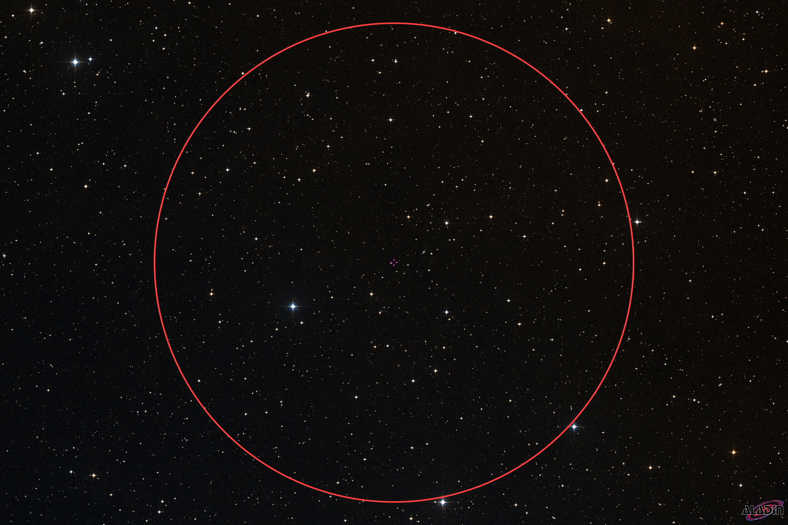
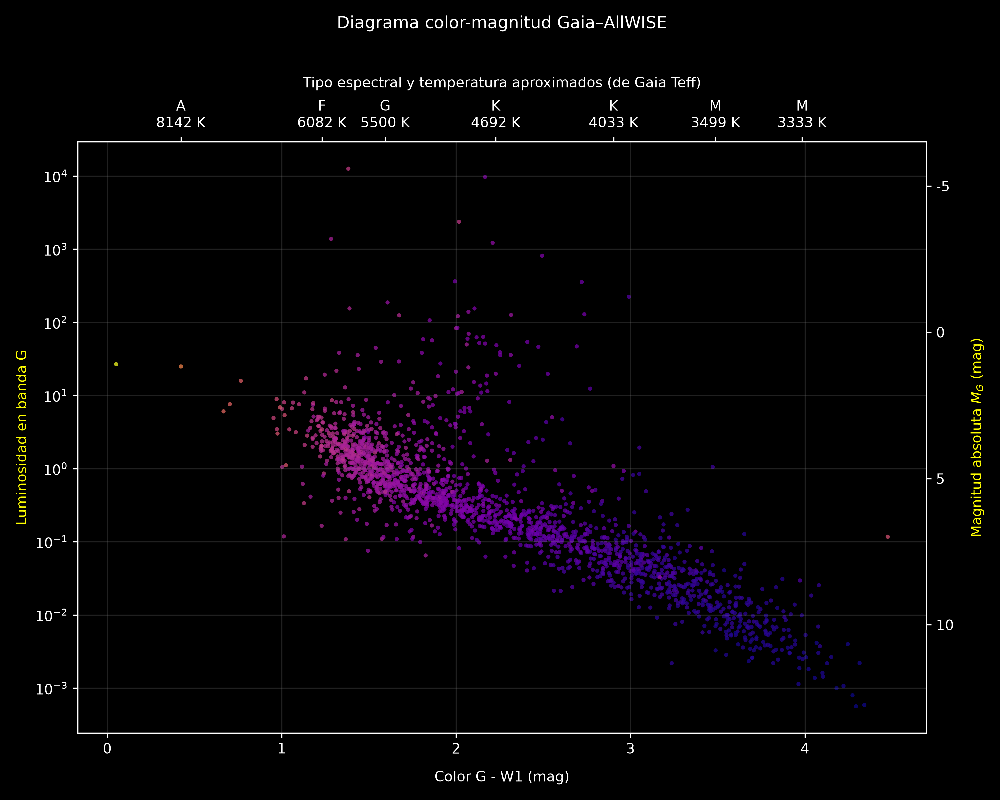
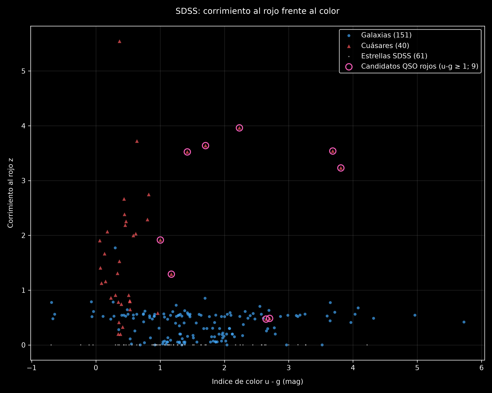
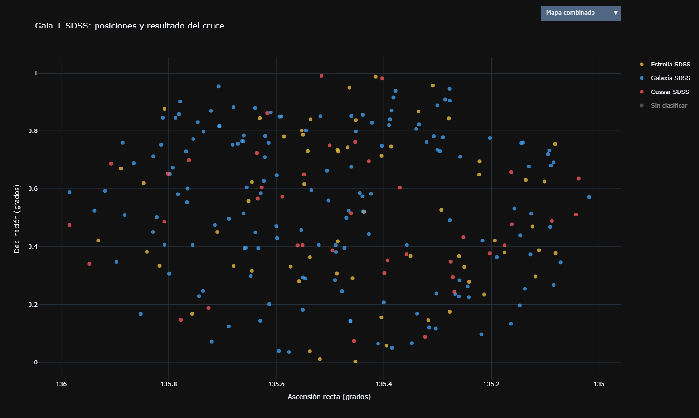

# Cartografía y caracterización de un campo profundo

## Objetivo

El proyecto estudia el campo ecuatorial centrado en **RA = 135.5° y Dec = 0.5°**, con radio **0.5°** (30 minutos de arco). Combina catálogos de distintas longitudes de onda y observaciones espectroscópicas para explorar estrellas de la Vía Láctea, galaxias y cuásares.

Gaia DR3 aporta posiciones, paralajes, movimientos propios, magnitud óptica G y temperatura efectiva estimada. AllWISE aporta la magnitud infrarroja W1. SDSS aporta clase espectroscópica, corrimiento al rojo y magnitudes ópticas `u` y `g`.

## Imágenes del campo

Estas imágenes presentan el contexto visual de la región observada; no son imágenes generadas por el cruce de tablas.

| Hubble | JWST |
|---|---|
|  |  |

## Árbol de archivos

```text
proyecto_mes2/
├── main.sh                         # Flujo principal, consultas, análisis y apertura del resultado
├── readme.md                       # Este documento
├── data/
│   ├── gaia_allwise.csv             # Descarga Gaia–AllWISE de VizieR
│   └── sdss_field.csv               # Descarga del campo SDSS
├── sample_data/
│   ├── gaia_allwise.csv             # Muestra de respaldo para Gaia–AllWISE
│   └── sdss_field.csv               # Muestra de respaldo para SDSS
├── scripts/
│   ├── extract_vizier.sh            # Consulta ADQL a VizieR TAP
│   ├── extract_sdss.sh              # Consulta SQL a SkyServer SDSS
│   ├── vizier_data_analysis.py      # Limpieza, resumen y diagrama Gaia–AllWISE
│   ├── sdss_data_analysis.py        # Limpieza, resumen y diagrama SDSS
│   ├── combined_catalogs.py         # Cruce espacial y gráfico interactivo Plotly
│   └── interactive_populations.py   # Visualización interactiva auxiliar
└── resultados/
    ├── color_magnitude_diagram.png
    ├── color_magnitude_diagram_sdss.png
    ├── gaia-sdss-posiciones-y-resultado-del-cru.png
    ├── combined_catalog.csv
    ├── combined_catalogs_interactive.html
    ├── Hubble_image.jpg
    └── cielo_profundo.png
```

Los archivos de `data/` son descargas locales y pueden regenerarse. Si una descarga no existe, está vacía o no contiene filas, los analizadores recurren al CSV correspondiente de `sample_data/` e informan el origen usado. Las imágenes de contexto se guardan en `resultados/` para que README pueda mostrarlas con rutas relativas.

## Requisitos y ejecución

Se necesita Bash, Python 3 y los paquetes `pandas`, `numpy`, `matplotlib` y `plotly`; las consultas requieren `curl` y `wget`. Desde WSL o una terminal con Bash, ejecuta desde la raíz del proyecto:

```bash
bash main.sh
```

`main.sh` consulta SDSS y VizieR. Si una consulta falla, informa del problema y continúa con los datos de muestra disponibles. Después genera los diagramas de cada catálogo, pregunta si quieres abrir los diagramas estáticos y construye el catálogo y gráfico interactivos. El gráfico interactivo se guarda como `resultados/combined_catalogs_interactive.html` y se abre en el navegador predeterminado del mismo equipo. El archivo incluye Plotly, así que no necesita descargar esa biblioteca desde Internet.

También puedes abrir el resultado manualmente desde el administrador de archivos: entra en `resultados/` y abre `combined_catalogs_interactive.html` con tu navegador. En WSL, si el navegador no se abre automáticamente, accede a la carpeta del proyecto desde Windows y abre allí el HTML. Esta forma de abrirlo es para el equipo local; no crea una dirección compartida para teléfonos u otros equipos.

## Flujo de trabajo y motivo de cada paso

### 1. Obtener Gaia DR3 y AllWISE mediante VizieR

`scripts/extract_vizier.sh` envía una consulta ADQL al servicio TAP de VizieR. Selecciona las fuentes Gaia dentro del círculo de 0.5° y solicita `RA_ICRS`, `DE_ICRS`, `Plx`, `pmRA`, `pmDE`, `Gmag` y `Teff`. Mediante un `LEFT JOIN` busca una contraparte AllWISE dentro de 2 segundos de arco y añade `W1mag`.

Se usa `LEFT JOIN` para conservar una fila Gaia aunque no haya una fuente AllWISE asociada. En esos casos `W1mag` queda vacío; no se debe confundir la falta de contraparte con una clase astronómica.

### 2. Limpiar y explorar Gaia–AllWISE

`scripts/vizier_data_analysis.py`:

1. Lee la descarga o, cuando no contiene datos, carga la muestra.
2. Convierte coordenadas, paralaje, movimientos, magnitudes y `Teff` a columnas numéricas. Los valores no interpretables pasan a `NaN`; las filas se conservan.
3. Marca como **estrella candidata de la Vía Láctea** cada fuente cuyo paralaje sea positivo. Es una selección preliminar, no una confirmación: no se está exigiendo que el paralaje sea significativo frente a su incertidumbre.
4. Calcula el movimiento propio total, `sqrt(pmRA² + pmDE²)`, para análisis posteriores.
5. Para las filas con paralaje positivo y magnitudes `Gmag` y `W1mag`, calcula el color `G−W1`. El diagrama resultante usa ese color en el eje horizontal y una luminosidad relativa aproximada en banda G en el eje vertical; incluye el eje de magnitud absoluta G y marcas orientativas de temperatura/tipo espectral.
6. Guarda `resultados/color_magnitude_diagram.png`.

La magnitud absoluta se estima usando el paralaje positivo. La incertidumbre de distancia puede ser grande para paralajes imprecisos, y el cálculo actual no corrige la extinción; por eso la luminosidad de banda G se debe interpretar como aproximada, no como luminosidad bolométrica total.

### 3. Obtener espectros y fotometría SDSS

`scripts/extract_sdss.sh` consulta `SpecObj` y `PhotoObjAll`. El `INNER JOIN` por `bestObjID = objID` relaciona la clasificación espectroscópica y `z` con las magnitudes `u` y `g` del objeto. Las condiciones de RA y Dec limitan la región y `fDistanceArcMinEq(...) <= 30` aplica el círculo de 30 minutos de arco centrado en las mismas coordenadas.

### 4. Limpiar y representar SDSS

`scripts/sdss_data_analysis.py`:

1. Lee la descarga o utiliza `sample_data/sdss_field.csv` como respaldo. Ignora una línea inicial como `#Table1` si está presente.
2. Comprueba las columnas `ra`, `dec`, `class`, `z`, `u` y `g`, convierte a números los campos cuantitativos y resume valores inválidos.
3. Calcula el índice óptico `u−g = u − g` y cuenta objetos por clase SDSS (`GALAXY`, `QSO`, `STAR`).
4. Grafica `z` frente a `u−g`, con símbolos y colores diferentes para galaxias, cuásares y estrellas.
5. Destaca los QSO con `u−g ≥ 1` como **candidatos de color rojo**. Es un corte exploratorio: por sí solo no demuestra que el enrojecimiento provenga de polvo.
6. Guarda `resultados/color_magnitude_diagram_sdss.png`.

Las filas sin coordenadas, `z`, `u` o `g` no pueden participar en la gráfica, pero no se eliminan del archivo original.

### 5. Comparar y cruzar las dos tablas

`scripts/combined_catalogs.py` utiliza las coordenadas ecuatoriales de ambos catálogos y calcula la separación angular esférica entre Gaia y SDSS. Acepta parejas de hasta **2 segundos de arco**. Si varias parejas posibles compiten por una fuente, ordena las candidatas por separación y asigna primero las más cercanas, limitando cada registro a una asociación.

Antes del cruce, el script normaliza campos numéricos y clases. Si encuentra identificadores Gaia repetidos por el cruce con AllWISE, prioriza la fila que tiene `W1mag`; para SDSS conserva una fila por posición, clase y corrimiento al rojo. Los CSV de entrada no se modifican.

El catálogo de salida conserva tres situaciones:

- **Emparejado**: hay una fuente Gaia y una SDSS dentro del radio; incluye `match_sep_arcsec`.
- **Solo Gaia**: no se encontró contraparte SDSS dentro del radio.
- **Solo SDSS**: no se encontró contraparte Gaia dentro del radio.

La clase SDSS (`GALAXY`, `QSO` o `STAR`) se utiliza cuando existe porque deriva del espectro. Para fuentes sin clase SDSS, paralaje Gaia positivo solo crea una etiqueta preliminar de estrella candidata. Un QSO o galaxia SDSS con paralaje Gaia positivo se marca como posible conflicto para inspección, pues podría indicar una asociación incorrecta, una medida astrométrica problemática o una situación que requiere revisión.

El radio de 2″ es un criterio práctico de asociación, no una prueba definitiva de identidad. En campos densos pueden existir coincidencias fortuitas; conviene revisar separaciones, clases y consistencia astrométrica. Los objetos no emparejados se conservan y no se fuerzan a otra categoría.

El programa escribe `resultados/combined_catalog.csv` y `resultados/combined_catalogs_interactive.html`. El HTML ofrece un selector para alternar entre:

1. **Mapa combinado**: posiciones RA/Dec por clase y estado del emparejamiento.
2. **Astrometría Gaia**: paralaje frente al movimiento propio total.
3. **Espectroscopía SDSS**: `z` frente a `u−g`; los objetos se separan por clase espectroscópica.

Al pasar el cursor sobre un punto se muestran campos del catálogo y el estado/separación del cruce. El color amarillo representa candidatas estelares, azul galaxias, rojo cuásares y gris objetos sin clasificar. La gráfica es interactiva: el selector cambia la vista y la leyenda permite alternar categorías.

## ¿Por qué combinar el óptico y el infrarrojo?

Las bandas ópticas muestran con detalle muchas estrellas y galaxias, pero el polvo interestelar absorbe y dispersa con mayor eficacia la luz óptica. El infrarrojo se atenúa menos al atravesar nubes de polvo y puede revelar fuentes oscurecidas en el óptico. Además, el polvo calentado emite energía infrarroja, y las estrellas frías pueden ser relativamente brillantes en esas bandas. AllWISE W1 observa a 3.4 micras. [Documentación de AllWISE](https://irsa.ipac.caltech.edu/data/WISE/docs/release/AllWISE/expsup/sec1_1.html)

Comparar `Gmag` con `W1mag` mediante `G−W1` permite estudiar cómo cambia el brillo relativo entre el óptico y el infrarrojo. No basta con ese color para declarar que un QSO está enrojecido por polvo: también lo afectan temperatura, corrimiento al rojo, extinción, tipo de fuente y errores de emparejamiento. Usar varias bandas produce una descripción más completa que observar solo el óptico, pero cada catálogo conserva límites de sensibilidad, resolución y cobertura.

## ¿Cómo se complementan Gaia y SDSS para distinguir estrellas y cuásares?

Gaia aporta **astrometría y cinemática**. Un paralaje significativo indica distancia cercana y un movimiento propio apreciable indica desplazamiento aparente respecto al fondo. Estas señales favorecen la interpretación de una estrella de la Vía Láctea. Un paralaje no significativo y movimiento propio no medible son compatibles con un objeto extragaláctico muy distante, pero también pueden reflejar una fuente débil o mediciones imprecisas. Por eso `Plx > 0` en este trabajo solo identifica candidatas y no constituye por sí mismo una clasificación segura. Gaia DR3 publica posiciones, paralajes y movimientos propios junto con otros productos astrofísicos. [Documentación Gaia DR3](https://gea.esac.esa.int/archive/documentation/GDR3/)

SDSS aporta **espectroscopía**. La clase del espectro y el desplazamiento de sus líneas permiten distinguir estrellas, galaxias y cuásares, y medir `z`. Un cuásar es el núcleo muy luminoso de una galaxia activa, alimentado por materia que acreta sobre un agujero negro supermasivo. El espectro permite reconocer el núcleo activo y el corrimiento al rojo muestra que su luz fue emitida a gran distancia cosmológica; no es una observación directa del agujero negro mismo. [SDSS: clasificación y corrimiento al rojo espectroscópico](https://www.sdss.org/dr19/software/pipelines/boss/)

En conjunto, una fuente con paralaje y movimiento propio significativos sería compatible con una estrella cercana; una fuente con clase `QSO` y corrimiento al rojo elevado sería compatible con un cuásar distante. El cruce posicional permite comparar ambas evidencias para la misma fuente candidata, mientras que el radio, la astrometría y las incertidumbres deben considerarse al interpretar el resultado.

## Figuras de resultados

### Diagrama color-magnitud Gaia–AllWISE



### SDSS: corrimiento al rojo frente a color



### Posiciones y resultado del cruce Gaia–SDSS



El HTML interactivo completo está en [resultados/combined_catalogs_interactive.html](resultados/combined_catalogs_interactive.html). Ábrelo en el navegador para usar el selector de vistas; la imagen PNG de arriba es una captura estática.

## Resultados y limitaciones

- `resultados/color_magnitude_diagram.png`: color `G−W1` y luminosidad relativa aproximada en banda G para fuentes Gaia candidatas con datos utilizables.
- `resultados/color_magnitude_diagram_sdss.png`: corrimiento al rojo frente al índice `u−g` para objetos SDSS.
- `resultados/combined_catalog.csv`: cruces aceptados y fuentes sin contraparte, con clasificación y estado.
- `resultados/combined_catalogs_interactive.html`: gráfico navegable entre posiciones, astrometría Gaia y fotometría/espectroscopía SDSS.

Los conteos cambian según se procesen descargas o muestras. Verifica los mensajes de consola para saber qué archivos se utilizaron. Las etiquetas de estrella por paralaje positivo y de QSO rojo por `u−g ≥ 1` son criterios de exploración; no sustituyen el análisis de incertidumbres, calidad de medidas, extinción ni inspección espectral.
